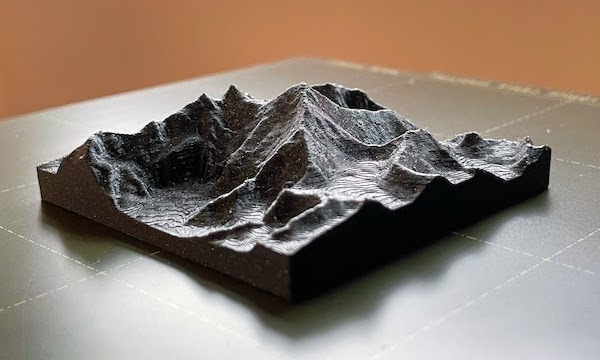

# 3d-topography

An in-browser tool to generate 3D-printable models from topography data.

For more information about the tool and how it works, [visit the served site](#try-it-out).

_Note: this tool was put together as a proof of concept. As a result, some shortcuts were taken during
development, such as using a simple triangulation algorithm, encoding output STL files in ASCII
(rather than binary) and not tree-shaking or bundling dependencies._

## Try it out

This repository is statically served using [GitHub Pages](https://pages.github.com/) at
https://michael-jb.github.io/3d-topography/.

## Built with

- [GitHub Pages](https://pages.github.com/) - Static hosting
- [OpenTopography](https://opentopography.org/) - Topogaphy API
- [OpenLayers](https://openlayers.org/) - Dynamic map service and interaction API
- [geotiff.js](https://www.npmjs.com/package/geotiff) - Read DEM data from GeoTIFF files
- [three.js](https://threejs.org/) - 3D rendering

## License

[MIT license](./LICENSE)
